# 포항시 문화관광 웹 어플리케이션
MVC Level2 Project

## :clipboard: 프로젝트 개요

- "포항시 문화관광" 이라는 주제로 MVC Level2 프로젝트 진행
- JSP, Servelet, Controller, 표현식과 스크립트릿을 활용한 view 작성, Ajax를 이용한 문화 관광 카테고리추가/관광지 등록 등의 기능 구현

## ⚙ 개발 환경
- 운영체제 : Windows 10
- 개발환경(IDE) : Eclipse
- JDK 버전 : JDK 1.8
- 데이터 베이스 : MariaDB
- 관리 툴 : GitHub

## 클래스 설계
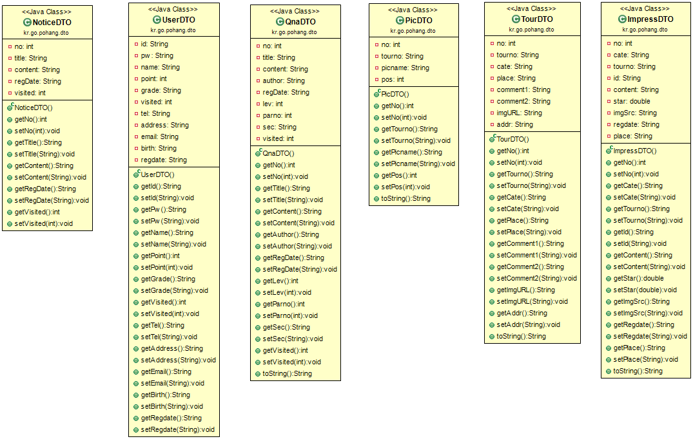

## DB 설계

## 💻기능 구현

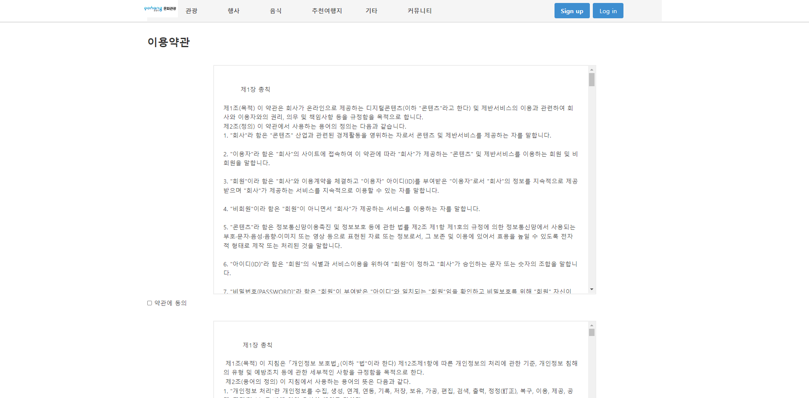

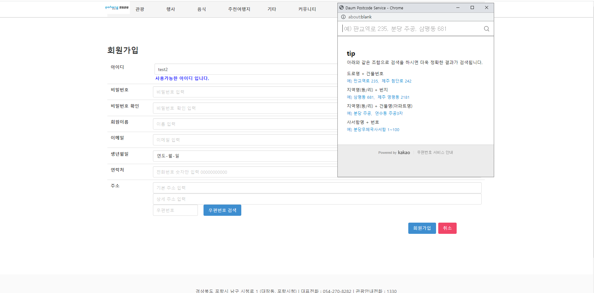
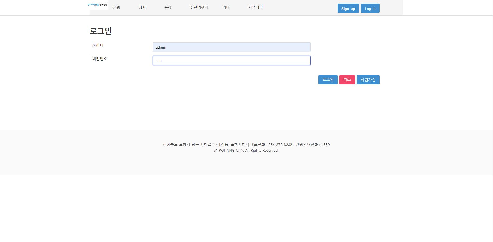
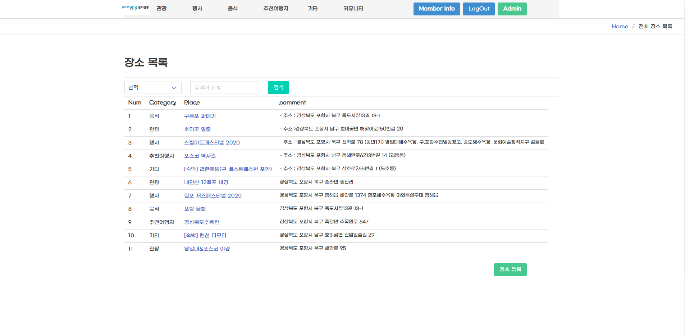

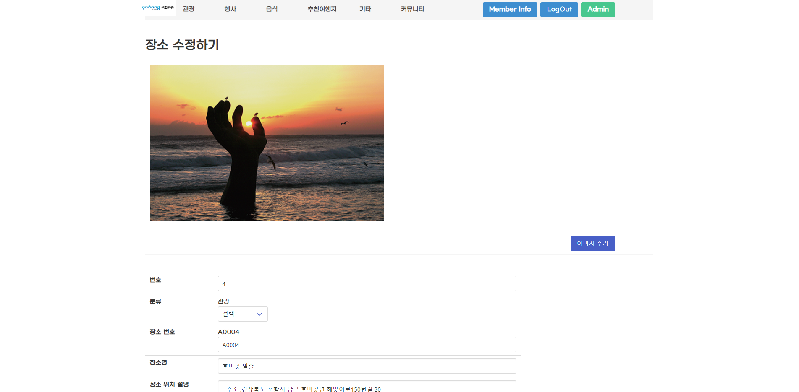

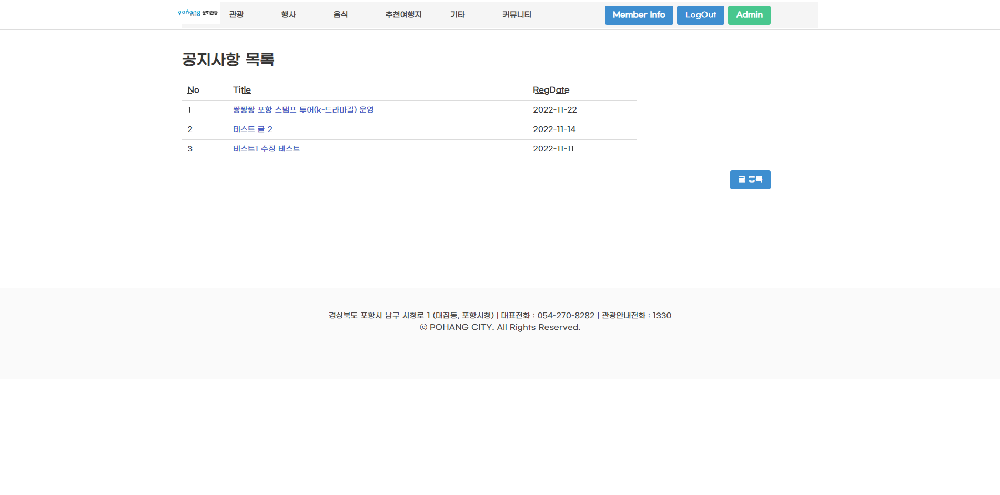

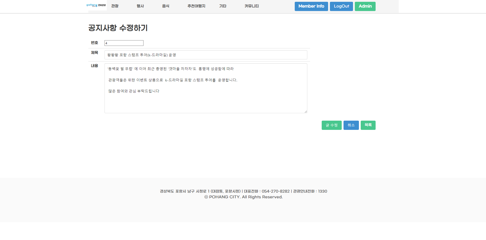

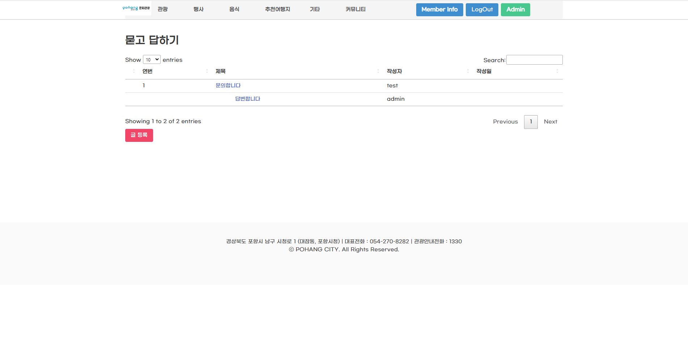

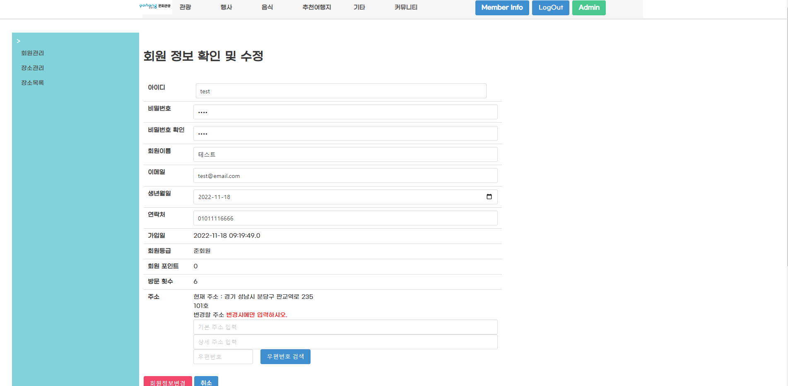
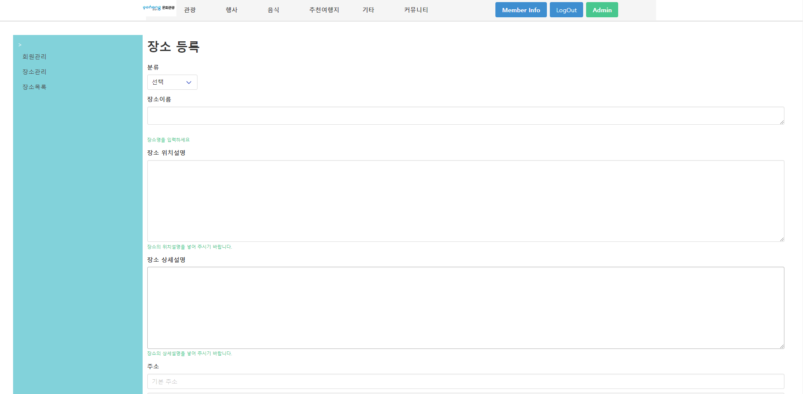

